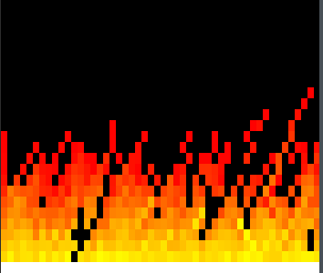

## The DOOM Fire Kata

### Intro
Ever since I came across the DOOM fire [trick](https://fabiensanglard.net/doom_fire_psx/), I've been itching to work my way through it using console graphics as a kata to exercise new languages. This post describes how I would approach it in [g-fu](https://github.com/codr7/g-fu/tree/master/v1), a pragmatic Lisp embedded in Go.


[Source](https://github.com/codr7/g-fu/blob/master/v1/demo/fire.gf)

### Setup
If you're in the mood to light your own fire, the following shell spell will take you where you need to go.

```
$ git clone https://github.com/codr7/g-fu.git
$ cd g-fu/v1
$ go build src/gfu.go
$ rlwrap ./gfu
g-fu v1.15

Press Return twice to evaluate.

  (load "demo/fire.gf")
```

### Syntax
g-fu quasi-quotes using `'` and splices using `%`, `_` is used for missing values and `..` to splat sequences.

### Idea
The idea is to model each fire-particle as a value that decays from white to black along a red/yellow gradient while moving upwards. This is the reason for the white line at the bottom, that's where new particles are born. Add a touch of pseudo-chaos to make it interesting, and that's pretty much it.

### Implementation
Particles are implemented using an array of bytes representing the green component of their colors. Red is locked at 255 and blue at 0 to get a nice gradient.

We start with the module header and utilities for manipulating the console, a complete list of control codes may be found [here](https://en.wikipedia.org/wiki/ANSI_escape_code).

```
(env fire (width 50 height 25
           buf (new-bin (* width height))
           out stdout
           max-fade 50
           avg-frames 0 avg-time .0)
  (fun ctrl (args..)
    (print out "\e[" args..))

  (fun clear ()
    (ctrl "2J"))

  (fun home ()
    (ctrl "H"))

  ...
```

Before we can start rendering, the bottom row needs to be initialized and the screen cleared.

```
  ...
  
  (fun init ()
    (for (width i)
      (set (# buf i) 0xff))

    (clear))
```

Rendering begins with a loop that fades and moves all particles. Direction of movement is either straight up or diagonal, the three cases are handled by the `if`. The color is faded unless already black and the particle is moved up one row. Note that particles are stored bottom-top, since that's the direction they move.

```
  ...
  
  (fun render ()
    (let t0 (now) i -1)

    (for ((- height 1) y)
      (for (width x)
        (let v (# buf (inc i))
             j (+ i width))
        
        (if (and x (< x (- width 1)))
          (inc j (- 1 (rand 3))))
        
        (set (# buf j)
             (if v (- v (rand (min max-fade (+ (int v) 1)))) v))))

        ...
```

Once all particles are faded and moved, its time to generate console output. We start by adding the top row to `i` and moving the cursor `home`, then compose the color and print a blank for each particle last-first. Keeping track of `prev-g` allows reusing the color control code for horizontal spans (which are mostly black). Before exiting, the output is flushed and frame rate recorded.

```
    ...

    (inc i (+ width 1))
    (let prev-g _)
    (home)
    
    (for (height y)
      (for (width x)
        (let g (# buf (dec i))
             r (if g 0xff 0)
             b (if (= g 0xff) 0xff 0))
             
        (if (= g prev-g)
          (print out " ")
          (ctrl "48;2;" (int r) ";" (int (set prev-g g)) ";" (int b) "m ")))

      (print out \n))

    (flush out)
    (inc avg-time (- (now) t0))
    (inc avg-frames))
```

Since it's rude to mess around with user console settings, we make sure that everything is put back in the right place before leaving. The first line resets the color.

```
  ...
  
  (fun restore ()
    (ctrl "0m")
    (clear)
    (home)))
```

The final few lines run 50 frames and print the average frame rate.

```
(fire/init)
(for 50 (fire/render))
(fire/restore)

(say (/ (* 1000000000.0 fire/avg-frames) fire/avg-time))
```

### Performance
While there's nothing seriously wrong with this implementation from my perspective, it's not going to win any performance prizes yet. [g-fu](https://github.com/codr7/g-fu/tree/master/v1) is still very young and I'm mostly focusing on correctness at this point. More mature languages with comparable features should be able to run this plenty faster. One thing that does come to mind is using a separate buffer for output and dumping that all at once to the console, the code supports switching output stream but g-fu is still missing support for memory streams.

Until next time,<br/>
c7